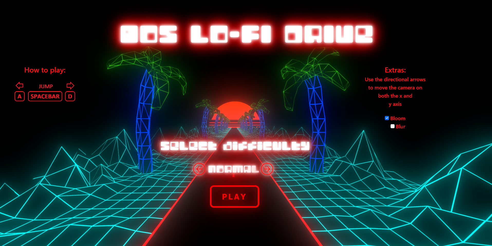

# 80s Lo-Fi Run

## IMPORTANT: note to the player
The game is heavily dependent on RAM and GPU. There is a high chance it will not run on a low spec PC how it was designed to run. For that matter, we will attach a video demonstration of how the game should work on a normal PC.

## Authors
* Aloisi Lorenzo - 1836344
* Di Tommaso Andrea - 1801802

## How to run
* Github Page : https://sapienzainteractivegraphicscourse.github.io/final-project-ditommaso-aloisi/
* Local : clone the repository or download it; create a localhost server; open **index.html** with your browser to play.

## How to play:
* A : Turn left
* D : Turn right
* Spacebar : Jump
* ↑ : Camera up
* ↓ : Camera down
* → : Camera right
* ← : Camera left

## DEMO

